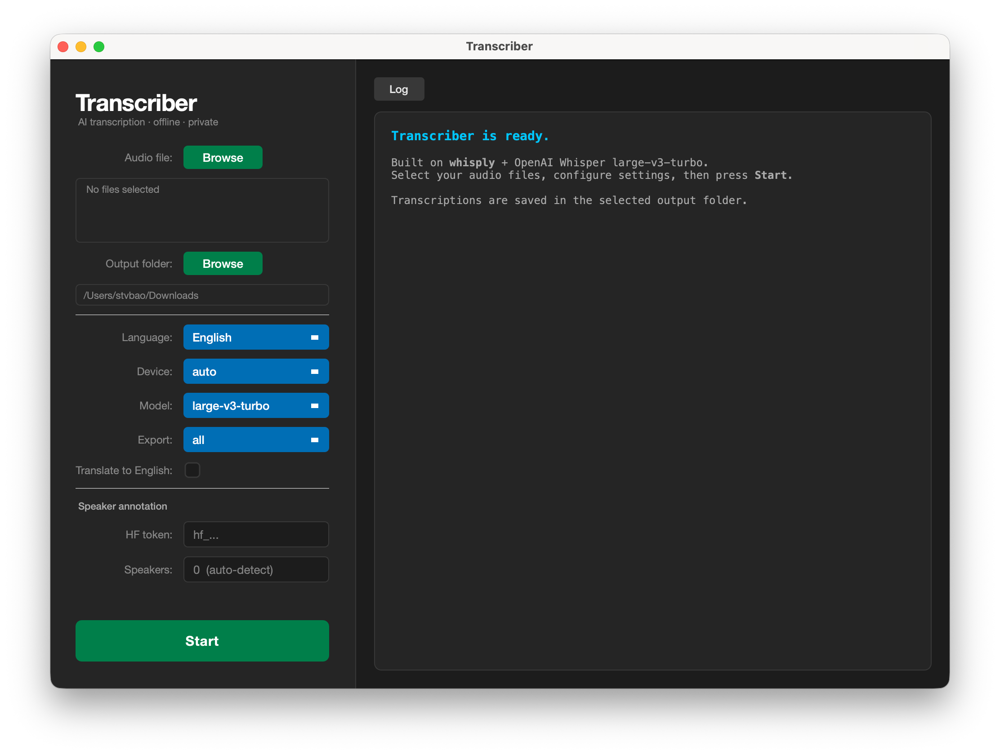

# Transcriber

A desktop transcription app for qualitative researchers. Built on [whisply](https://github.com/tsmdt/whisply) and OpenAI's **Whisper** model— fully offline, no cloud, no data leaving your machine.



## Features

- **Desktop GUI** — no terminal needed after setup
- **Offline** — audio never leaves your machine
- **99+ languages** — including non-Latin scripts
- **Speaker annotation** — automatically labels who is speaking
- **Multiple output formats** — `txt`, `srt`, `vtt`, `webvtt`, `json`, `html`, `rttm`
- **Batch processing** — select multiple files and process them in one run
- **Apple Silicon optimised** — uses MLX for fast transcription on M1–M5 Macs
- **Translation** — optionally translate transcriptions to English

## Requirements

- [uv](https://docs.astral.sh/uv/) — Python package manager
- [ffmpeg](https://ffmpeg.org) — audio conversion
- [whisply](https://github.com/tsmdt/whisply) — transcription backend

## Installation

**1. Install uv**

macOS:
```bash
curl -LsSf https://astral.sh/uv/install.sh | sh
```

Windows:
```powershell
powershell -ExecutionPolicy ByPass -c "irm https://astral.sh/uv/install.ps1 | iex"
```

**2. Install ffmpeg**

macOS:
```bash
brew install ffmpeg
```

Windows:
```bash
winget install Gyan.FFmpeg
```

**3. Install whisply**

```bash
uv tool install whisply
```

**4. Clone this repo and install dependencies**

```bash
git clone https://github.com/stvbao/transcriber
cd transcriber/app
uv sync
```

## Running

macOS — double-click `transcriber.command`

Windows — double-click `transcriber.bat`
## Speaker Annotation

Speaker annotation automatically labels each speaker (e.g. `SPEAKER_00`, `SPEAKER_01`). It requires a free HuggingFace account:

1. Create a token at [hf.co/settings/tokens](https://hf.co/settings/tokens)
2. Accept the license for both pyannote models:
   - [hf.co/pyannote/speaker-diarization-3.1](https://hf.co/pyannote/speaker-diarization-3.1)
   - [hf.co/pyannote/segmentation-3.0](https://hf.co/pyannote/segmentation-3.0)
3. Paste your token into the HF token field in the app

Models are downloaded once on first use and cached locally — fully offline after that.

## Data Privacy

- Audio files never leave your machine
- No API keys or cloud services used for transcription
- No telemetry or usage data sent anywhere
- HuggingFace is contacted once to download models — offline after that

## Credits

- [whisply](https://github.com/tsmdt/whisply) by [@tsmdt](https://github.com/tsmdt)
- [Whisper](https://github.com/openai/whisper) by OpenAI
- [pyannote.audio](https://github.com/pyannote/pyannote-audio) by pyannote
